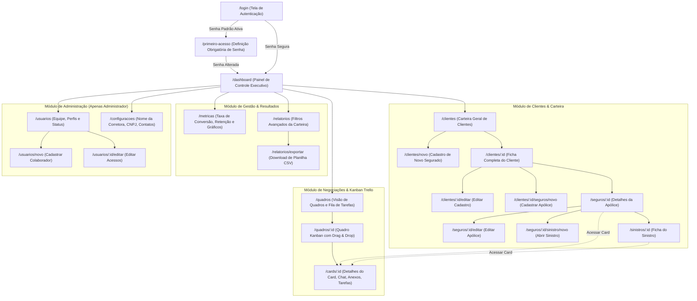

# Mapa de Navegação e Rotas do Sistema

Este documento apresenta a estrutura completa de telas, menus e rotas de navegação da aplicação.

---

## 🗺️ Mapa de Telas e Navegação

```mermaid
flowchart TD
    LOGIN["/login (Tela de Autenticação)"]
    PRIMEIRO_ACESSO["/primeiro-acesso (Definição Obrigatória de Senha)"]

    DASHBOARD["/dashboard (Painel de Controle Executivo)"]

    subgraph CLIENTES_MODULE["Módulo de Clientes & Carteira"]
        CLIENTES["/clientes (Carteira Geral de Clientes)"]
        CLIENTE_NOVO["/clientes/novo (Cadastro de Novo Segurado)"]
        CLIENTE_DETALHE["/clientes/:id (Ficha Completa do Cliente)"]
        CLIENTE_EDITAR["/clientes/:id/editar (Editar Cadastro)"]

        SEGURO_NOVO["/clientes/:id/seguros/novo (Cadastrar Apólice)"]
        SEGURO_DETALHE["/seguros/:id (Detalhes da Apólice)"]
        SEGURO_EDITAR["/seguros/:id/editar (Editar Apólice)"]

        SINISTRO_NOVO["/seguros/:id/sinistro/novo (Abrir Sinistro)"]
        SINISTRO_DETALHE["/sinistros/:id (Ficha do Sinistro)"]
    end

    subgraph KANBAN_MODULE["Módulo de Negociações & Kanban Trello"]
        QUADROS["/quadros (Visão de Quadros e Fila de Tarefas)"]
        PIPELINE["/quadros/:id (Quadro Kanban com Drag & Drop)"]
        CARD_DETALHE["/cards/:id (Detalhes do Card, Chat, Anexos, Tarefas)"]
    end

    subgraph GESTAO_MODULE["Módulo de Gestão & Resultados"]
        METRICAS["/metricas (Taxa de Conversão, Retenção e Gráficos)"]
        RELATORIOS["/relatorios (Filtros Avançados da Carteira)"]
        EXPORTAR_CSV["/relatorios/exportar (Download de Planilha CSV)"]
    end

    subgraph ADMIN_MODULE["Módulo de Administração (Apenas Administrador)"]
        USUARIOS["/usuarios (Equipe, Perfis e Status)"]
        USUARIO_NOVO["/usuarios/novo (Cadastrar Colaborador)"]
        USUARIO_EDITAR["/usuarios/:id/editar (Editar Acessos)"]
        CONFIGURACOES["/configuracoes (Nome da Corretora, CNPJ, Contatos)"]
    end

    %% Fluxo de Acesso
    LOGIN -->|Senha Padrão Ativa| PRIMEIRO_ACESSO
    PRIMEIRO_ACESSO -->|Senha Alterada| DASHBOARD
    LOGIN -->|Senha Segura| DASHBOARD

    %% Menu Principal
    DASHBOARD --> CLIENTES
    DASHBOARD --> QUADROS
    DASHBOARD --> METRICAS
    DASHBOARD --> RELATORIOS
    DASHBOARD --> USUARIOS
    DASHBOARD --> CONFIGURACOES

    %% Navegação Clientes
    CLIENTES --> CLIENTE_NOVO
    CLIENTES --> CLIENTE_DETALHE
    CLIENTE_DETALHE --> CLIENTE_EDITAR
    CLIENTE_DETALHE --> SEGURO_NOVO
    CLIENTE_DETALHE --> SEGURO_DETALHE
    SEGURO_DETALHE --> SEGURO_EDITAR
    SEGURO_DETALHE --> SINISTRO_NOVO
    SEGURO_DETALHE --> SINISTRO_DETALHE

    %% Navegação Kanban
    QUADROS --> PIPELINE
    PIPELINE --> CARD_DETALHE
    SEGURO_DETALHE -.->|Acessar Card| CARD_DETALHE
    SINISTRO_DETALHE -.->|Acessar Card| CARD_DETALHE

    %% Gestão
    RELATORIOS --> EXPORTAR_CSV

    %% Administração
    USUARIOS --> USUARIO_NOVO
    USUARIOS --> USUARIO_EDITAR
```
